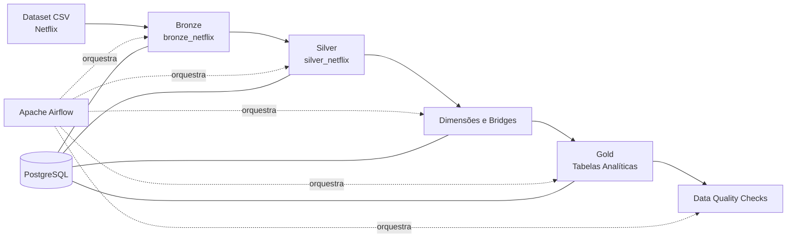
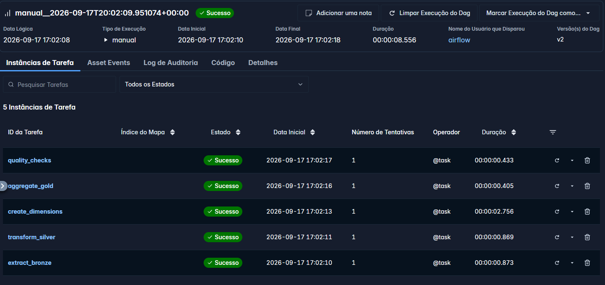

# Projeto — Pipeline de Engenharia de Dados | Netflix

**Stack:** Python · SQL · PostgreSQL · Apache Airflow · Docker · Pandas · Git

## Contexto do Projeto

Este projeto tem como objetivo construir um pipeline de dados utilizando o dataset **Netflix Movies and TV Shows**, passando pelas etapas de ingestão, transformação, modelagem e disponibilização dos dados para consumo analítico.

A arquitetura foi organizada seguindo o modelo de camadas **Bronze, Silver e Gold**.

A camada Bronze preserva os dados provenientes do arquivo CSV em seu formato original. Na camada Silver são realizadas as transformações, tratamentos de qualidade e modelagem dos dados. Por fim, a camada Gold disponibiliza tabelas agregadas voltadas para consumo analítico.

O pipeline foi desenvolvido utilizando Python e SQL, com PostgreSQL como banco de dados e Apache Airflow para orquestração das etapas em ambiente Docker.

O fluxo contempla:

- ingestão dos dados para a camada Bronze;
- limpeza e padronização na camada Silver;
- modelagem de dimensões e tabelas de associação;
- criação de agregações analíticas na camada Gold;
- validações automatizadas de qualidade dos dados;
- orquestração do pipeline com Apache Airflow.

## Arquitetura do Projeto

O pipeline foi estruturado em camadas, separando a ingestão dos dados brutos, as transformações, a modelagem analítica e as validações de qualidade.



### Fluxo do Pipeline

**Bronze:** realiza a ingestão do dataset original para o PostgreSQL, preservando a estrutura e os dados provenientes do arquivo CSV.

**Silver:** aplica limpeza, padronização, conversão de tipos e tratamento das inconsistências identificadas durante o profiling dos dados.

**Dimensões e Bridges:** normaliza atributos multivalorados, como países, diretores, atores e gêneros, utilizando dimensões e tabelas de associação para representar os relacionamentos muitos-para-muitos.

**Gold:** cria tabelas agregadas voltadas para consultas e análises sobre o catálogo da Netflix.

**Data Quality:** executa validações automatizadas após o processamento e faz a execução falhar caso alguma das regras de qualidade seja violada.

O Apache Airflow é responsável pela orquestração e pelas dependências entre as etapas, enquanto o PostgreSQL é utilizado para armazenamento e processamento das diferentes camadas.

## Estrutura dos Dados e Profiling

Antes da construção das camadas do pipeline, foi realizada uma etapa de profiling para compreender a estrutura e a qualidade dos dados de origem.

O dataset utilizado possui **8.807 registros e 12 colunas**, contendo informações sobre filmes e séries disponíveis no catálogo da Netflix.

**Fonte do dataset:** [Netflix Movies and TV Shows — Kaggle](https://www.kaggle.com/datasets/shivamb/netflix-shows)

Entre os campos analisados estão:

- `show_id`: identificador do conteúdo;
- `type`: tipo do conteúdo (`Movie` ou `TV Show`);
- `title`: título;
- `director`: diretor(es);
- `cast`: elenco;
- `country`: país(es) de produção;
- `date_added`: data de inclusão no catálogo;
- `release_year`: ano de lançamento;
- `rating`: classificação indicativa;
- `duration`: duração em minutos ou número de temporadas;
- `listed_in`: gêneros/categorias;
- `description`: descrição do conteúdo.

### Principais problemas identificados

O profiling revelou alguns pontos que precisavam ser tratados durante a transformação para a camada Silver:

- presença de valores nulos em campos como `director`, `cast` e `country`;
- valores de duração, como `74 min`, encontrados incorretamente na coluna `rating`;
- diferentes formatos na coluna `duration`, representando minutos para filmes e temporadas para séries;
- campos multivalorados armazenados em uma única coluna e separados por vírgula, como `country`, `director`, `cast` e `listed_in`;
- necessidade de conversão de `date_added` para o tipo `DATE`;
- necessidade de padronização e remoção de espaços adicionais nos valores textuais;
- ocorrência de valores repetidos dentro de campos multivalorados, identificada durante a criação das tabelas de associação.

Essas verificações serviram como base para definir as regras de transformação e modelagem aplicadas nas etapas seguintes do pipeline.

## Construção do Pipeline de Dados

Após o profiling, o processamento dos dados foi organizado em três camadas: Bronze, Silver e Gold. Essa separação permite manter os dados brutos, aplicar transformações de forma controlada e disponibilizar estruturas próprias para consumo analítico.

### Bronze — Ingestão dos Dados

A camada Bronze representa a entrada dos dados no pipeline.

A ingestão é realizada em Python a partir do arquivo CSV original, carregando os **8.807 registros** para a tabela `bronze_netflix` no PostgreSQL.

Nesta etapa, os dados são mantidos próximos ao formato de origem, permitindo preservar uma referência dos dados antes das transformações.

Principais responsabilidades da camada Bronze:

- leitura do dataset utilizando Python e Pandas;
- conexão com o PostgreSQL;
- carga dos dados na tabela `bronze_netflix`;
- preservação dos dados brutos para as etapas seguintes.

O processo de ingestão está implementado em `ingestion/extract_bronze.py`.

---

### Silver — Limpeza e Modelagem

A camada Silver é responsável pela limpeza, padronização e estruturação dos dados provenientes da Bronze.

Entre as principais transformações realizadas estão:

- conversão de `date_added` para o tipo `DATE`;
- conversão de `release_year` para tipo numérico;
- tratamento de valores nulos em atributos como diretor, elenco, país e classificação;
- correção de registros em que valores de duração estavam presentes na coluna `rating`;
- separação da duração em `duration_value` e `duration_unit`;
- padronização de valores textuais;
- definição de `show_id` como chave primária.

Além da limpeza, os campos multivalorados foram normalizados por meio da criação de dimensões e tabelas de associação.

Foram criadas as dimensões:

- `dim_country`;
- `dim_director`;
- `dim_actor`;
- `dim_genre`.

E suas respectivas tabelas de associação:

- `bridge_show_country`;
- `bridge_show_director`;
- `bridge_show_actor`;
- `bridge_show_genre`.

As tabelas bridge permitem representar os relacionamentos muitos-para-muitos existentes no dataset. Um conteúdo pode, por exemplo, possuir diversos atores, gêneros ou países associados, enquanto cada ator, gênero ou país também pode estar relacionado a diversos conteúdos.

As transformações e a modelagem estão implementadas em `transform/silver_transform.sql` e `transform/silver_dimensions.sql`.

---

### Gold — Agregações Analíticas

A camada Gold disponibiliza dados preparados para consultas e análises, evitando que consumidores precisem reconstruir as regras de transformação e os relacionamentos da camada Silver.

Foram desenvolvidas quatro tabelas analíticas:

#### `gold_catalogo_por_genero`

Apresenta a quantidade de conteúdos por gênero, utilizando a dimensão de gêneros e sua tabela de associação.

#### `gold_conteudo_por_pais_ano`

Apresenta a quantidade de conteúdos por país e ano de lançamento, permitindo analisar a distribuição do catálogo ao longo do tempo.

#### `gold_lancamentos_por_ano`

Consolida a quantidade de filmes e séries por ano de lançamento, além do total de conteúdos.

#### `gold_top_generos_por_decada`

Apresenta os cinco gêneros com maior quantidade de conteúdos em cada década. O ranking é construído utilizando a window function `RANK()` particionada por década.

As agregações da camada Gold estão implementadas em `transform/gold_aggregations.sql`.

## Data Quality

Após o processamento das camadas do pipeline, foram implementadas validações automatizadas para verificar a consistência dos dados na camada Silver.

Os principais controles verificam:

- ausência de valores de duração na coluna `rating`;
- consistência entre `duration`, `duration_value` e `duration_unit`;
- ausência de valores nulos em `country` após o tratamento;
- ausência de valores nulos em `director` após o tratamento;
- preenchimento do identificador `show_id`;
- validade dos valores de `release_year`.

As validações foram implementadas em PostgreSQL utilizando blocos PL/pgSQL com `IF EXISTS` e `RAISE EXCEPTION`.

Dessa forma, uma inconsistência não gera apenas um resultado para inspeção manual. Caso alguma regra seja violada, o PostgreSQL lança uma exceção, fazendo com que a execução da etapa de qualidade falhe no Airflow.

Exemplo simplificado:

```sql
DO $$
BEGIN
    IF EXISTS (
        SELECT 1
        FROM silver_netflix
        WHERE rating LIKE '%min%'
    ) THEN
        RAISE EXCEPTION 'Quality check failed: duração encontrada na coluna rating';
    END IF;
END $$;
```

Esse mecanismo transforma as regras de qualidade em **quality gates** do pipeline, impedindo que uma execução com dados inconsistentes seja considerada bem-sucedida.

As validações estão implementadas em `transform/quality_checks.sql`.

## Orquestração com Apache Airflow

O pipeline foi orquestrado utilizando **Apache Airflow**, executado em ambiente Docker.

A DAG `netflix_pipeline` organiza o processamento em cinco tasks executadas de forma sequencial:

```text
extract_bronze
      ↓
transform_silver
      ↓
create_dimensions
      ↓
aggregate_gold
      ↓
quality_checks
```

Cada task possui uma responsabilidade específica:

- `extract_bronze`: realiza a leitura do dataset e a carga da tabela `bronze_netflix`;
- `transform_silver`: executa as regras de limpeza e transformação da camada Silver;
- `create_dimensions`: cria as dimensões e tabelas bridge utilizadas na modelagem;
- `aggregate_gold`: constrói as tabelas analíticas da camada Gold;
- `quality_checks`: executa as validações automatizadas de qualidade dos dados.

As dependências entre as tasks garantem que uma etapa seja executada somente após a conclusão bem-sucedida da etapa anterior.

A DAG utiliza uma **Airflow Connection** chamada `netflix_postgres` para armazenar os parâmetros de conexão com o PostgreSQL, evitando a exposição de credenciais diretamente no código.

O ambiente do Airflow é executado com Docker Compose, permitindo que os componentes necessários para a orquestração sejam executados de maneira isolada e reproduzível.

### Execução da DAG

A imagem abaixo demonstra uma execução completa do pipeline no Apache Airflow, com todas as etapas concluídas com sucesso:



## Estrutura do Projeto

O projeto foi organizado separando as responsabilidades de ingestão, transformação, orquestração e configuração do ambiente.

```text
projeto-midia-netflix/
│
├── dags/
│   └── netflix_pipeline_dag.py
│
├── data/                          # local, não versionado
│   └── netflix_titles.csv
│
├── ingestion/
│   └── extract_bronze.py
│
├── transform/
│   ├── silver_transform.sql
│   ├── silver_dimensions.sql
│   ├── gold_aggregations.sql
│   └── quality_checks.sql
│
├── profiling/
│   └── ...
│
├── docs/
│   └── images/
│       └── airflow_dag_success.png
│
├── config/                        # local, não versionado
│   └── .env
│
├── pipeline.py
├── docker-compose.yaml
├── pyproject.toml
├── uv.lock
├── .gitignore
└── README.md
```

### Principais componentes

- `ingestion/`: contém o código Python responsável pela ingestão dos dados para a camada Bronze.
- `transform/`: contém as transformações SQL das camadas Silver e Gold, a modelagem dimensional e as validações de qualidade.
- `dags/`: contém a definição da DAG responsável pela orquestração do pipeline no Apache Airflow.
- `profiling/`: reúne as consultas utilizadas durante a análise inicial e investigação da qualidade dos dados.
- `data/`: contém localmente o dataset utilizado como fonte do pipeline. A pasta não é versionada no Git.
- `docs/`: armazena imagens e outros recursos utilizados na documentação.
- `pipeline.py`: permite executar o fluxo Bronze → Silver → Dimensions/Bridges → Gold → Quality Checks diretamente via Python, sem utilizar o Airflow.
- `docker-compose.yaml`: define o ambiente necessário para execução do Apache Airflow em containers.
- `config/.env`: utilizado para configuração local de conexão com o banco de dados e mantido fora do versionamento por conter informações sensíveis.

## Como Executar o Projeto

### Pré-requisitos

Para executar o projeto é necessário possuir:

- Python 3.14 ou superior;
- PostgreSQL;
- Docker e Docker Compose;
- Git.

Clone o repositório e acesse a pasta do projeto:

```bash
git clone https://github.com/EduardoHSM47/projeto-midia-netflix.git
cd projeto-midia-netflix
```

### Dataset

O arquivo CSV não é versionado no repositório.

Baixe o dataset **Netflix Movies and TV Shows** no Kaggle:

https://www.kaggle.com/datasets/shivamb/netflix-shows

Depois, crie a pasta `data/` na raiz do projeto e coloque o arquivo com o seguinte caminho:

```text
data/netflix_titles.csv
```

### Instalação das dependências Python

As dependências estão declaradas no `pyproject.toml`.

Uma opção é criar um ambiente virtual e instalar o projeto:

```bash
python -m venv .venv
```

No Windows PowerShell:

```powershell
.venv\Scripts\Activate.ps1
pip install -e .
```

### Configuração do PostgreSQL

Crie um banco PostgreSQL para armazenar as camadas do pipeline.

Para a execução local, crie a pasta `config/` e o arquivo `config/.env` com os parâmetros da sua instalação:

```env
DB_HOST=127.0.0.1
DB_PORT=5432
DB_NAME=Projeto_Netflix
DB_USER=seu_usuario
DB_PASSWORD=sua_senha
```

O arquivo `.env` está incluído no `.gitignore` e não deve ser versionado.

### Execução local

Com o PostgreSQL disponível, o dataset no diretório correto e as dependências instaladas, execute:

```bash
python pipeline.py
```

O `pipeline.py` executa sequencialmente:

```text
Bronze
  ↓
Silver
  ↓
Dimensions / Bridges
  ↓
Gold
  ↓
Quality Checks
```

### Execução com Apache Airflow

O Airflow é executado por meio do Docker Compose.

Como o `docker-compose.yaml` utiliza um arquivo `.env` na raiz para configuração do ambiente Docker, crie um arquivo `.env` na raiz do projeto antes da primeira inicialização.

Em ambiente Windows, um arquivo simples pode ser utilizado:

```env
AIRFLOW_UID=50000
```

Em seguida, inicialize o ambiente:

```bash
docker compose up airflow-init
```

Depois suba os serviços:

```bash
docker compose up -d
```

Após a inicialização dos containers, acesse a interface do Airflow em:

```text
http://localhost:8080
```

Antes de executar a DAG, configure no Airflow uma conexão PostgreSQL com o seguinte **Connection ID**:

```text
netflix_postgres
```

A conexão deve apontar para o banco PostgreSQL utilizado pelo projeto. Quando o PostgreSQL estiver sendo executado na máquina host e o Airflow dentro do Docker, utilize:

```text
Host: host.docker.internal
Database: Projeto_Netflix
Port: 5432
```

O usuário e a senha devem corresponder às credenciais da instalação PostgreSQL local.

Após configurar a conexão, localize a DAG:

```text
netflix_pipeline
```

e execute o pipeline pela interface do Airflow.

A DAG executará:

```text
extract_bronze
      ↓
transform_silver
      ↓
create_dimensions
      ↓
aggregate_gold
      ↓
quality_checks
```

Uma execução é considerada bem-sucedida somente após a conclusão das transformações e das validações de qualidade.

Para encerrar o ambiente do Airflow:

```bash
docker compose down
```

## Decisões Técnicas e Limitações

### Decisões Técnicas

Algumas decisões foram adotadas para manter o projeto simples, reproduzível e adequado ao objetivo de demonstrar conceitos de Engenharia de Dados.

- **Arquitetura Bronze, Silver e Gold:** utilizada para separar ingestão, transformação e consumo analítico.
- **PostgreSQL como banco de dados:** escolhido para armazenar todas as camadas e executar as transformações SQL.
- **Python na ingestão:** utilizado para leitura do arquivo CSV e carga inicial dos dados na camada Bronze.
- **SQL nas transformações:** utilizado para limpeza, modelagem dimensional, criação das tabelas bridge e agregações analíticas.
- **Tabelas bridge para campos multivalorados:** utilizadas para representar corretamente os relacionamentos muitos-para-muitos entre conteúdos, atores, diretores, países e gêneros.
- **Airflow para orquestração:** responsável por controlar a ordem de execução e as dependências entre as etapas do pipeline.
- **Docker para o ambiente do Airflow:** utilizado para executar os componentes da plataforma de forma isolada.
- **Airflow Connection para credenciais:** as informações de acesso ao PostgreSQL não ficam diretamente armazenadas no código da DAG.
- **Quality gates:** as validações utilizam exceções no PostgreSQL para fazer a task falhar caso alguma regra de qualidade seja violada.

### Limitações

O projeto utiliza um dataset estático em arquivo CSV, portanto não existe uma fonte de dados sendo atualizada continuamente.

As cargas são realizadas no modelo de **full refresh**. A tabela Bronze é recriada durante a ingestão e as estruturas das camadas seguintes também são reconstruídas a cada execução. Para volumes maiores ou fontes atualizadas frequentemente, uma evolução natural seria implementar processamento incremental.

A DAG foi configurada sem agendamento automático (`schedule=None`), sendo executada manualmente no Airflow. Em um cenário produtivo, poderia ser definida uma frequência de execução de acordo com a atualização da fonte de dados.

A conexão `netflix_postgres` precisa ser configurada manualmente no ambiente do Airflow antes da primeira execução.

O projeto foi desenvolvido para execução local, com PostgreSQL executado na máquina host e Airflow em containers Docker. Por esse motivo, a comunicação entre o Airflow e o banco utiliza `host.docker.internal`.

O objetivo do projeto é demonstrar conceitos de ingestão, transformação, modelagem, qualidade e orquestração de dados, e não reproduzir uma arquitetura distribuída de produção em larga escala.
